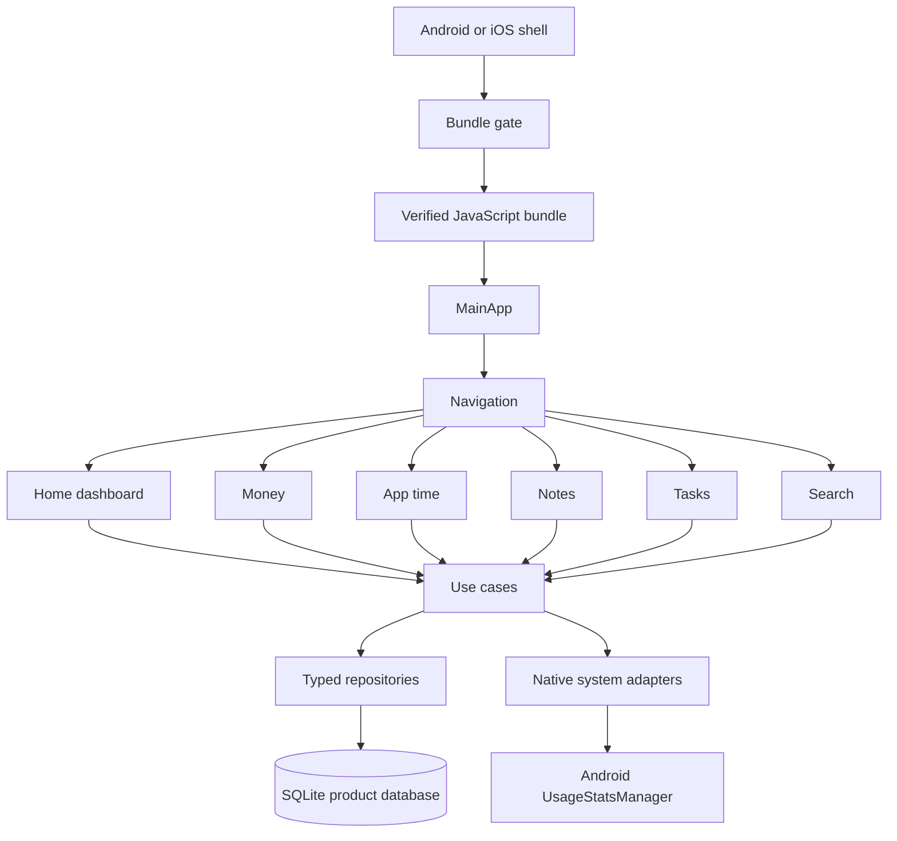
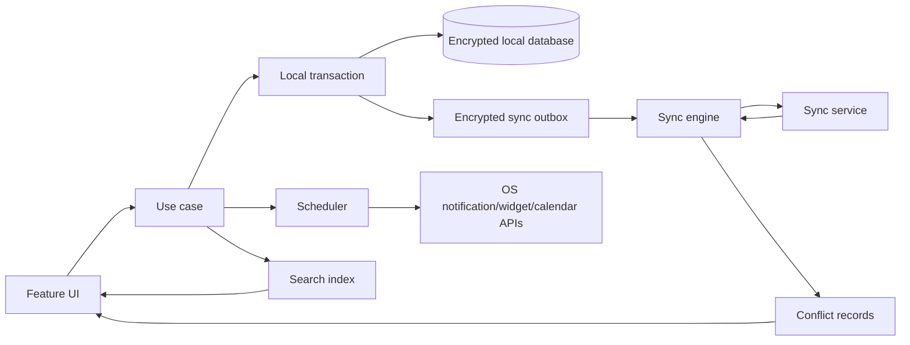

# Architecture

Status: Core implementation through the task-dependency pass with the full-product target architecture. The installer bridge, SQLite repository boundary, app shell, core screens, reports, account balances, transfers, split entries, normalized financial tables, budget projections, exports, local deletion, recurring money and task rules with missed-occurrence policies, optional local reminder times on recurring task rules, task dependencies with cycle rejection and completed-prerequisite blocking, validated JSON restore, password-encrypted local backups, local recovery-key backups, encrypted backup file save/open, schema 23 notification settings and task reminders, Android `Open`, idempotent `Complete`, configurable `Snooze`, and separate global and recurring-task reminder switches exist; broader notification automation, sync, and advanced adapters remain planned.

## System shape

Task-list, task-dependency, and task-reminder actions stay in the local AppStore boundary. List names are validated before save; list deletion checks task and recurring-rule references before changing the workspace. A dependency points from a prerequisite task to a dependent task, supports the `completed` condition, rejects self-links, duplicates, and cycles, and prevents completion while any prerequisite is incomplete. Deleting a task removes its dependency edges in the same workspace save. Due task rules are expanded in the same startup save that expands money rules, before `MainApp` receives workspace data. Startup then synchronizes future reminders for open tasks only when the global Task reminders category is enabled and, for tasks linked to a recurring rule, when recurring-task reminders are enabled. Android reminder intents carry only the stable task ID and an `Open`, `Complete`, or `Snooze` action. `Complete` performs one open-to-completed transition and preserves the logical reminder timestamp; `Snooze` replaces the logical reminder with the selected duration after the action time and applies quiet-hours projection to the native alarm. A paused category clears its native schedules, keeps logical timestamps, and makes stale `Snooze` actions no-ops. Missing or completed targets are no-ops; a blocked target remains open. Restore synchronizes the incoming reminder set before commit and restores the previous native set if the restore fails.

Yuzuha uses a local-first feature architecture. The installer is a native-shell concern and runs before the JavaScript product shell is shown.



## Layer rules

### Native shell

Owns the embedded bundle, bundle metadata request, download, hash/signature verification, atomic activation, and the launch gate. It must not contain money, note, or task rules.

### JavaScript application shell

Owns navigation, theme, startup state, error boundaries, and feature composition. `MainApp` is rendered only after the installer returns a verified launch result.

### Feature modules

Each feature owns its screens, view models/hooks, validation, and use cases. Features call typed repositories or system adapters; they do not call SQLite or native APIs directly from UI components.

### Data layer

Owns the current schema, transactions, repositories, and serialization. Product records belong in SQLite. There is no AsyncStorage product-data path.

### Native system adapters

Hide platform APIs behind typed interfaces. The first Android adapter is app usage access. Future iOS adapters must implement the same interface only when the behavior has an honest platform equivalent.

## Startup sequence

1. Native shell loads the embedded baseline and reads the last verified bundle record.
2. Installer validates local metadata and selects the last-known-good bundle as the provisional candidate.
3. Installer fetches remote metadata with a bounded timeout.
4. If the remote version is newer and compatible, installer downloads to a temporary path.
5. Installer checks size, SHA-256, signature, and bundle compatibility.
6. Installer atomically promotes the verified file and writes the activation record.
7. JavaScript starts from the selected verified bundle.
8. `MainApp` opens the local database, requires repository schema 2 and app schema 23, and renders the first screen.

If a step fails, the installer returns a named result such as `offline-local`, `invalid-remote`, or `no-verified-bundle`. The UI may explain the result, but it must not silently run an unverified file. See `installer.md`.

## Planned module tree

```text
src/
  app/                 startup state, navigation, theme
  features/
    home/
    money/
    appTime/
    notes/
    tasks/
  data/                database and repositories
  platform/            Android and iOS adapters
  installer/           JavaScript-side installer bridge and status types
  shared/              validation, dates, formatting, error types
```

## Key technology decisions

- React Native 0.86.0, React 19.2.8, TypeScript 5.9.x, Metro 0.86.x, and CLI 20.2.x are the current implementation baseline. This supersedes the older planning baseline.
- TypeScript strict mode is required.
- `@op-engineering/op-sqlite` `17.1.2` is the current product store bridge. The app-owned repository boundary keeps native SQL out of feature UI and uses transactions for full-workspace writes.
- Product data does not use AsyncStorage. Preferences and installer metadata need their own explicit owner before they are added.
- Navigation, SQLite binding, encryption, and analytics packages must be selected from maintained packages during implementation and recorded in `decision-log.md`.
- No remote sync layer is required for the MVP.

## Current repository boundary

`SqliteWorkspaceStore` keeps non-financial records, notes, attachments, recurrence rules, tasks, and task dependencies as typed JSON rows and stores money entries, transfers, split parents/lines, and budgets in normalized tables. It opens only repository schema 2 and rejects older or unknown repository schemas. A new database is seeded with the current empty app data; there is no legacy AsyncStorage import. Malformed current records block the workspace instead of guessing or discarding data. Money reports, account balances, and budget projections are rebuildable projections over loaded source records and never combine currencies. Transfers are source records, not income or expense rows. Split entries are one parent record plus normalized lines and are expanded only in report projections. Budgets count matching expense entries and split lines within their local period; carry-forward adds only the previous period's unused positive balance to the current effective limit. Data tools serialize current app schema 23 records as versioned JSON, serialize money entries as versioned CSV, share through Android's system sheet, create password-encrypted or local recovery-key XChaCha20-Poly1305 backups using scrypt and secure random salt/nonce values, save encrypted backup JSON through the system document picker using an app-cache temporary file, open encrypted backup JSON through the document picker, validate current-schema pasted or opened JSON/decrypted backup content before preview, replace the workspace only after confirmation, and reset to empty workspace defaults only after confirmation. Recovery keys are generated in memory, confirmed, and never stored. Note attachment files are copied from the system picker into app-private document storage, checked for supported MIME type, size, and SHA-256 checksum, and linked to one note by stable metadata. Current encrypted backup schema 2 payloads include each verified attachment file as authenticated base64 with its ID, size, and checksum. Plain JSON restore does not accept attachments because it has no file bytes. On Android, Notes passes one validated attachment path and MIME type to a native FileProvider bridge; the bridge keeps the file under the app-private attachments directory and gives the external viewer read access only to that URI. Recurrence rules use local calendar dates, generate due money entries once according to their all/one/skip policy, and advance their next date transactionally before the workspace is shown.

Saved searches and task dependencies are stored as typed JSON rows in `app_records` under current app schema 23. The Notes screen owns the local name/query/archive-visibility rules and calls the repository through `AppStore`; Apply and Delete do not introduce a global index or sync state. The Tasks screen owns prerequisite/dependent selection and deletion; the repository validates task references and dependency cycles before restore or save.

Global search is a derived local projection over the loaded `AppData`; it does not add a database table or index. The Search screen searches supported records in memory, hides archived records unless requested, and only searches included app-time snapshots after Usage Access is granted. Deleted records cannot match because deletion removes them from the local collections.

Tasks created from notes store `sourceNoteId` in the task record. The source note is not changed, and a missing source ID remains valid so the Tasks screen can show `Deleted note` after the source is removed.

Recurring tasks store their own title, details, priority, list, local cadence, interval, next date, missed-occurrence policy, optional local `HH:mm` reminder time, and pause state. Startup expansion creates open task records for due dates, copies the rule reminder time into each generated task's local timestamp, and advances the rule beyond every missed date in one repository save. Past generated reminder timestamps are retained as logical values but are not scheduled because the active reminder projection only includes future times. Open tasks can also store one future local reminder timestamp. `taskDependencies` stores prerequisite/dependent task pairs with the local `completed` condition; an incomplete prerequisite blocks completion, and deleting a task removes its edges. `notificationSettings` stores an optional daily local start/end pair, a local snooze duration of 15, 30, 60, or 120 minutes, a global Task reminders switch, and a recurring-task reminders switch. The AppStore keeps the logical task timestamp in `AppData` and projects it through the quiet-hours window before scheduling only when the relevant switches allow it. The Android adapter schedules the projected time with a stable task ID, cancels it on completion/delete/clear, posts privacy-safe notification text, rebuilds alarms after boot, and passes the task ID through cold-start and warm-app notification intents so the Tasks screen opens the matching task in edit mode. Notifications addressed to the rule itself, background automation, templates, and series editing remain planned.

## Error boundaries

Every layer returns typed errors with a stable code and user-safe message. UI code decides how to display the error. Logs may include technical context, but never note bodies, transaction descriptions, or raw usage records.

## Developer note: installer-aware changes

Any change that touches startup order, bundle cache paths, metadata fields, version comparison, verification, or activation must update `installer.md`, add or adjust installer tests in `testing.md`, and add a release checklist item in `release.md`. A feature is not complete until the bundle gate still runs before `MainApp`.

## Full-product components

The full product adds these components without weakening the installer boundary:

- `sync`: encrypted outbox, pull cursor, change application, conflict records, device state;
- `crypto`: native key storage, workspace keys, recovery and backup encryption;
- `search`: local full-text index, filters, rebuilds, and delete cleanup;
- `scheduler`: reminders, recurrence, quiet hours, and bounded background work;
- `imports`: staged parsers, mapping, duplicate detection, and rollback;
- `integrations`: share, widgets, calendar, shortcuts, deep links, and file picker adapters;
- `reports`: period queries, currency separation, budgets, goals, and review summaries;
- `support`: redacted diagnostics and user-controlled support package generation.

## Full-product data flow



Local commit is the user-visible source of truth. Sync, search indexing, notifications, and integration writes consume committed changes and must be idempotent. None of them may partially commit a feature record.

## Service boundary

The installer service publishes signed JavaScript bundles. The sync service stores encrypted change envelopes. They have separate credentials, deployments, logs, rate limits, incident paths, and release approvals. A bundle update must never require a sync account, and a sync outage must not block local app use.

## Platform capability model

Native adapters expose capability queries rather than platform checks spread through UI code:

```ts
type Capability =
  | 'usageAccess'
  | 'notifications'
  | 'calendarRead'
  | 'calendarWrite'
  | 'widgets'
  | 'shareCapture'
  | 'shortcuts'
  | 'backgroundRefresh';
```

Each capability returns `available`, `permissionRequired`, `restricted`, or `unsupported`, with a user-safe reason. The UI renders the result and a next action.

## Full-product architecture constraints

- Financial totals are calculated from committed transaction records, never from telemetry or cached card values.
- Search indexes and notification schedules are rebuildable projections.
- Attachments are content-addressed by checksum and are not considered committed before the database and file agree.
- Sync applies remote changes inside a database transaction and writes a conflict record instead of choosing an unsafe merge.
- A future migration, if approved after public release, must update schema, projections, sync encoding, export schema, and fixtures together.
