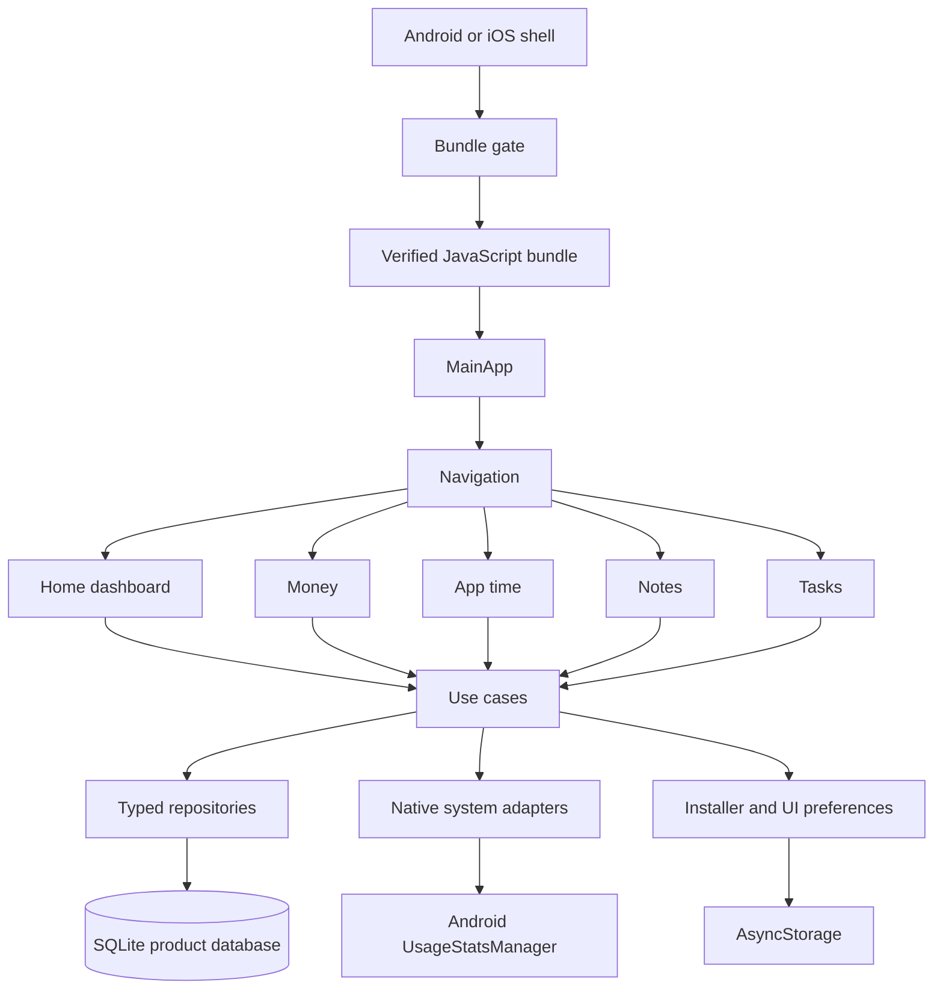
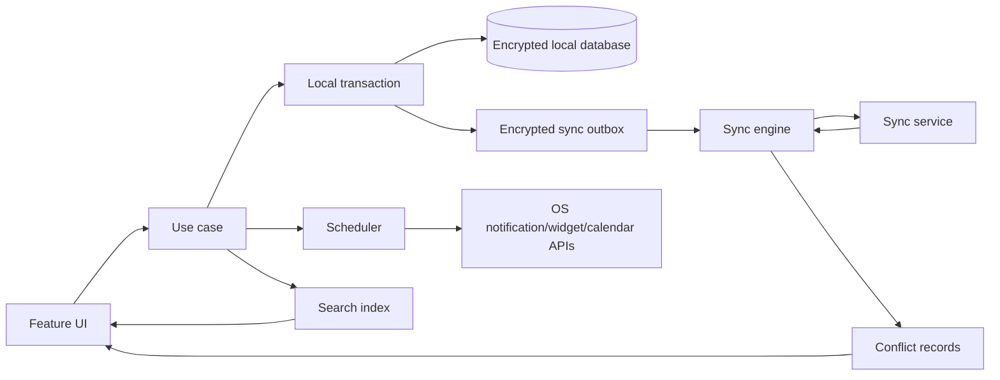

# Architecture

Status: Core implementation through the local note attachment storage pass with the full-product target architecture. The installer bridge, SQLite repository boundary, app shell, core screens, reports, account balances, transfers, split entries, normalized financial tables, budget projections, exports, local deletion, recurring money rules with missed-occurrence policies, validated JSON restore, password-encrypted local backups, local recovery-key backups, encrypted backup file save/open, and local note attachment storage exist; encrypted attachment bundling, sync, and advanced adapters remain planned.

## System shape

Yuzuha uses a local-first feature architecture. The installer is a native-shell concern and runs before the JavaScript product shell is shown.



## Layer rules

### Native shell

Owns the embedded bundle, bundle metadata request, download, hash/signature verification, atomic activation, and the launch gate. It must not contain money, note, or task rules.

### JavaScript application shell

Owns navigation, theme, startup state, error boundaries, and feature composition. `MainApp` is rendered only after the installer returns a verified launch result.

### Feature modules

Each feature owns its screens, view models/hooks, validation, and use cases. Features call typed repositories or system adapters; they do not call SQLite or native APIs directly from UI components.

### Data layer

Owns schema, migrations, transactions, repositories, and serialization. Product records belong in SQLite. AsyncStorage is for small preferences and installer metadata only.

### Native system adapters

Hide platform APIs behind typed interfaces. The first Android adapter is app usage access. Future iOS adapters must implement the same interface only when the behavior has an honest platform equivalent.

## Startup sequence

1. Native shell loads the embedded baseline and reads the last verified bundle record.
2. Installer validates local metadata and selects the last-known-good bundle as the provisional candidate.
3. Installer fetches remote metadata with a bounded timeout.
4. If the remote version is newer and compatible, installer downloads to a temporary path.
5. Installer checks size, SHA-256, signature, and bundle compatibility.
6. Installer atomically promotes the verified file and writes the activation record.
7. JavaScript starts from the selected verified bundle.
8. `MainApp` opens the local database, runs non-destructive migrations, and renders the first screen.

If a step fails, the installer returns a named result such as `offline-local`, `invalid-remote`, or `no-verified-bundle`. The UI may explain the result, but it must not silently run an unverified file. See `installer.md`.

## Planned module tree

```text
src/
  app/                 startup state, navigation, theme
  features/
    home/
    money/
    appTime/
    notes/
    tasks/
  data/                database, migrations, repositories
  platform/            Android and iOS adapters
  installer/           JavaScript-side installer bridge and status types
  shared/              validation, dates, formatting, error types
```

## Key technology decisions

- React Native 0.86.0, React 19.2.8, TypeScript 5.9.x, Metro 0.86.x, and CLI 20.2.x are the current implementation baseline. This supersedes the older planning baseline.
- TypeScript strict mode is required.
- `@op-engineering/op-sqlite` `17.1.2` is the current product store bridge. The app-owned repository boundary keeps native SQL out of feature UI and uses transactions for full-workspace writes.
- AsyncStorage is limited to small, non-relational state.
- Navigation, SQLite binding, encryption, and analytics packages must be selected from maintained packages during implementation and recorded in `decision-log.md`.
- No remote sync layer is required for the MVP.

## Current repository boundary

`SqliteWorkspaceStore` keeps non-financial records, notes, attachments, and recurrence rules as typed JSON rows and stores money entries, transfers, split parents/lines, and budgets in normalized tables. Repository schema 1 is migrated to schema 2 by reading the old rows and rewriting them in one transaction. Legacy AsyncStorage data is imported once on first open. Unsupported SQLite schema versions and malformed payloads block the workspace instead of guessing or discarding data. Money reports, account balances, and budget projections are rebuildable projections over loaded source records and never combine currencies. Transfers are source records, not income or expense rows. Split entries are one parent record plus normalized lines and are expanded only in report projections. Budgets count matching expense entries and split lines within their local period; carry-forward adds only the previous period's unused positive balance to the current effective limit. Data tools serialize all supported records as versioned JSON, serialize money entries as versioned CSV, share through Android's system sheet, create password-encrypted or local recovery-key XChaCha20-Poly1305 backups using scrypt and secure random salt/nonce values, save encrypted backup JSON through the system document picker using an app-cache temporary file, open encrypted backup JSON through the document picker, validate pasted or opened JSON/decrypted backup content before preview, replace the workspace only after confirmation, and reset to empty workspace defaults only after confirmation. Recovery keys are generated in memory, confirmed by re-entry, and never stored. Note attachment files are copied from the system picker into app-private document storage, checked for supported MIME type, size, and SHA-256 checksum, and linked to one note by stable metadata. JSON and encrypted backups carry that metadata but not the private file bytes yet. Recurrence rules use local calendar dates, generate due money entries once according to their all/one/skip policy, and advance their next date transactionally before the workspace is shown. Old SQLite recurrence payloads without the new policy are read as `all` and are written in the next normal save.

## Error boundaries

Every layer returns typed errors with a stable code and user-safe message. UI code decides how to display the error. Logs may include technical context, but never note bodies, transaction descriptions, or raw usage records.

## Developer note: installer-aware changes

Any change that touches startup order, bundle cache paths, metadata fields, version comparison, verification, or activation must update `installer.md`, add or adjust installer tests in `testing.md`, and add a release checklist item in `release.md`. A feature is not complete until the bundle gate still runs before `MainApp`.

## Full-product components

The full product adds these components without weakening the installer boundary:

- `sync`: encrypted outbox, pull cursor, change application, conflict records, device state;
- `crypto`: native key storage, workspace keys, recovery and backup encryption;
- `search`: local full-text index, filters, rebuilds, and delete cleanup;
- `scheduler`: reminders, recurrence, quiet hours, and bounded background work;
- `imports`: staged parsers, mapping, duplicate detection, and rollback;
- `integrations`: share, widgets, calendar, shortcuts, deep links, and file picker adapters;
- `reports`: period queries, currency separation, budgets, goals, and review summaries;
- `support`: redacted diagnostics and user-controlled support package generation.

## Full-product data flow



Local commit is the user-visible source of truth. Sync, search indexing, notifications, and integration writes consume committed changes and must be idempotent. None of them may partially commit a feature record.

## Service boundary

The installer service publishes signed JavaScript bundles. The sync service stores encrypted change envelopes. They have separate credentials, deployments, logs, rate limits, incident paths, and release approvals. A bundle update must never require a sync account, and a sync outage must not block local app use.

## Platform capability model

Native adapters expose capability queries rather than platform checks spread through UI code:

```ts
type Capability =
  | 'usageAccess'
  | 'notifications'
  | 'calendarRead'
  | 'calendarWrite'
  | 'widgets'
  | 'shareCapture'
  | 'shortcuts'
  | 'backgroundRefresh';
```

Each capability returns `available`, `permissionRequired`, `restricted`, or `unsupported`, with a user-safe reason. The UI renders the result and a next action.

## Full-product architecture constraints

- Financial totals are calculated from committed transaction records, never from telemetry or cached card values.
- Search indexes and notification schedules are rebuildable projections.
- Attachments are content-addressed by checksum and are not considered committed before the database and file agree.
- Sync applies remote changes inside a database transaction and writes a conflict record instead of choosing an unsafe merge.
- A migration must update schema, projections, sync encoding, export schema, and fixtures together.
