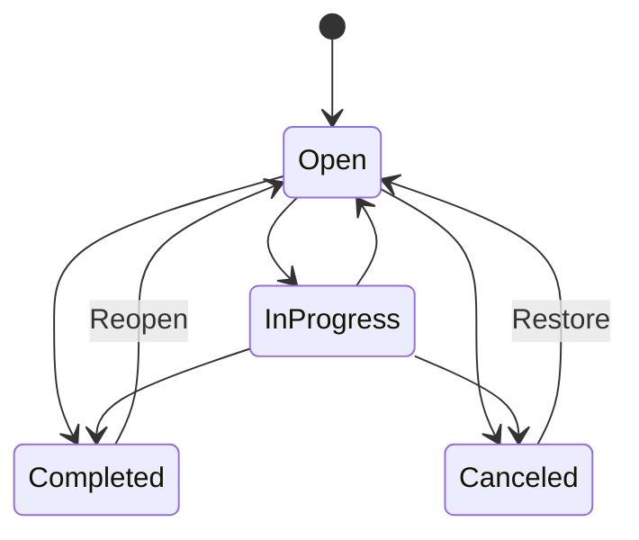

# Full product specification

Status: Planned full-product behavior. MVP requirements are the first release slice of this specification.

## 1. Product modes

Yuzuha has two modes:

### Local-only mode

- No account is required.
- All records, indexes, settings, and usage snapshots stay on the device.
- The user can export, import, back up according to the platform policy, and delete data.
- The app displays a clear warning when a requested multi-device feature is unavailable.

### Synced mode

- The user opts in and creates or joins a personal account.
- Devices sync encrypted records through the Yuzuha service.
- The service cannot read note bodies, transaction details, task details, or raw usage records.
- The user controls device enrollment, revocation, recovery, and sync pause.
- Local use continues during an outage; changes wait in an encrypted outbox.

## 2. Global object rules

Every user object has:

- a stable UUID;
- `createdAt` and `updatedAt` timestamps;
- a local timezone context when a local date matters;
- a schema version;
- a deletion tombstone when sync is enabled;
- links to related objects by UUID, never by display name.

User-visible names may change without changing identity. Deleted objects are removed from normal search, but synced tombstones remain until all enrolled devices acknowledge them or the retention policy expires.

## 3. Home and reviews

### Home behavior

Home is a configurable view, not a second source of truth. Cards read from feature queries and show:

- the value;
- the period;
- the last refresh time;
- a source or permission note when relevant;
- the next action.

Cards are reorderable and hideable. A reset action restores the default layout. The default layout has money, app time, tasks, and notes.

### Review behavior

The user can open a daily, weekly, or monthly review. A review contains:

1. tasks due, completed, overdue, and carried forward;
2. money income, spending, transfers, budget status, and recurring charges;
3. app-time total, top groups, goals, and comparison with the selected baseline;
4. notes created or pinned in the period;
5. optional user reflection text.

All comparisons state the baseline and do not use judgmental wording. If source data is incomplete, the review identifies the missing source instead of filling the gap.

## 4. Money specification

### Concepts

- `Account`: a user-defined money location. It is not a bank connection by itself.
- `Transaction`: income, expense, transfer, refund, or adjustment.
- `Category`: hierarchical label used in reports and budgets.
- `Payee`: optional normalized name.
- `Budget`: planned amount for a category and period.
- `Goal`: target amount and optional date.
- `Recurring rule`: schedule that proposes or creates a transaction.
- `Import session`: a reviewable batch of external rows.

### Transaction rules

- Amount is positive minor units; direction is represented by type.
- Transfers have source and destination accounts and do not affect spending totals.
- Refunds can link to an original expense and may reduce a category total according to the user’s report setting.
- Split transactions sum exactly to the parent amount.
- Editing a transaction updates reports immediately and records a local change history when history is enabled.
- Deleting a transaction requires confirmation and updates linked budgets and goals.
- Different currencies are never silently added. Reports show separate currency totals or use an explicitly configured conversion snapshot.

### Budgets

A budget has a category, amount, currency, period, start rule, and rollover policy. The UI shows planned, used, remaining, and percentage only when the denominator is valid. A negative remaining value is shown as over budget, not hidden.

### Imports

Import is a staged transaction:

1. choose a file or provider;
2. detect format and show sample rows;
3. map fields and currency/date rules;
4. detect likely duplicates;
5. preview totals and errors;
6. commit as one undoable session;
7. show the import report.

No import changes the database before the user confirms the preview.

## 5. App-time specification

### Sources

The source adapter reports what the platform exposes. Android uses Usage Access and app package data. iOS uses only approved system capabilities and may provide a narrower report. The UI always shows the source and coverage.

### Goals and groups

The user can create an app group, assign installed packages, choose a daily or weekly target, and set a comparison period. App assignment is local configuration. Unknown or uninstalled apps remain in historical data but are labeled unavailable.

### Focus sessions

A focus session has start, end, optional task/project/note link, optional app group, and completion state. A manually stopped session records the stop reason. Sessions do not claim to block apps unless a future platform adapter explicitly supports blocking.

### Data refresh

The app reads system usage on demand, when returning to the app, and at a user-configured refresh window. It must not promise real-time values. A refresh can be skipped when the permission is absent, the range is invalid, or the platform has no data.

## 6. Notes specification

### Note structure

A note has title, body, tags, folder, pinned state, archive state, timestamps, and optional links. Rich text has a plain-text representation for search, export, and compatibility.

### Attachments

Attachments have UUID, MIME type, byte size, local path, checksum, and parent note. The app rejects unsupported types and files above the configured limit before copying them. An attachment is not considered saved until its checksum and database record agree.

### History and search

Synced notes keep revision metadata and allow restore. Search indexes title, plain text, tags, and configured linked names. Search indexes are rebuilt after migration and removed during deletion.

## 7. Task and project specification

### Task state machine

The MVP may expose only open and completed states, but storage should not make the later states impossible.

### Recurrence

The user chooses a recurrence rule and a missed-occurrence policy: create all missed occurrences, create one next occurrence, or skip missed occurrences. The policy is shown before save. Generated tasks link back to the rule and can be edited without changing the rule unless the user chooses `Edit series`.

### Projects and dependencies

A project groups tasks, notes, budget links, and focus sessions. A dependency blocks a task until its source task reaches the configured state. Cycles are rejected at save time.

## 8. Cross-feature links

Supported links include:

- note to task or project;
- task to focus session;
- money transaction to note or goal;
- budget to category;
- review to any source record.

Deleting a linked object preserves the other object and replaces the link with a visible `Deleted item` marker until the user removes it. Links never depend on titles.

## 9. Search and commands

Global search supports text, filters, and date ranges. Search is local in local-only mode and searches decrypted local indexes in synced mode. The command surface includes create, complete, archive, move, link, export, and open settings actions. Destructive actions require confirmation; create/edit actions support undo where practical.

## 10. Settings

Settings are grouped as:

- appearance and language;
- time, date, currency, and week rules;
- dashboard and review behavior;
- notifications and automation;
- permissions and integrations;
- storage, export, backup, sync, and devices;
- privacy, diagnostics, help, and legal.

Every setting has a current value, a reset rule, and a statement of which data it affects.

## 11. Product limits

Limits must be enforced before work is saved and shown in the error. Initial limits should cover note size, attachment size/count, task title length, import row count, database size warning, and sync outbox size. Exact values are implementation decisions, but every limit needs a reason and a test.

## 12. Full-product definition of done

The full product is complete only when:

- all feature areas in this document have implemented behavior or an explicit deferred status;
- local-only and synced modes have separate acceptance tests;
- data can be exported and deleted;
- migrations and conflict handling are tested with real fixtures;
- Android and iOS capability differences are visible in the UI;
- accessibility and localization gates pass;
- release, support, incident, and rollback procedures are exercised;
- no feature silently changes financial totals, reminders, or user data.

