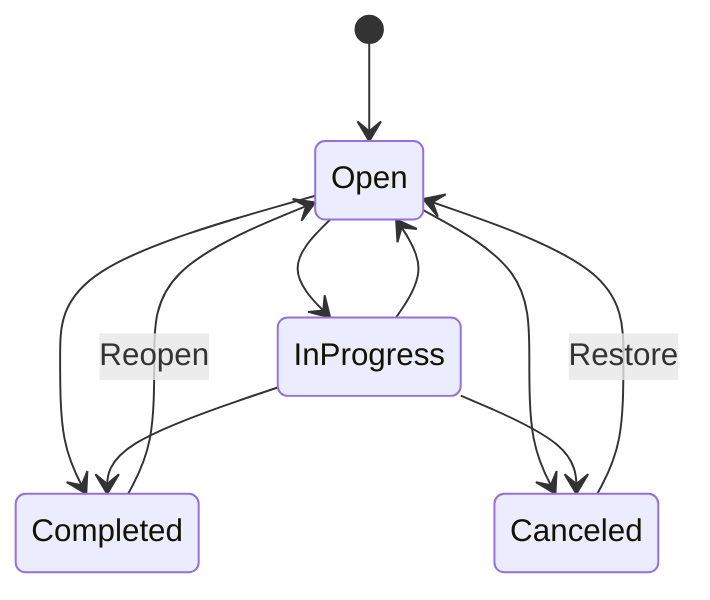

# Full product specification

Status: Planned full-product behavior. MVP requirements are the first release slice of this specification.

## 1. Product modes

Yuzuha has two modes:

### Local-only mode

- No account is required.
- All records, indexes, settings, and usage snapshots stay on the device.
- The user can export, import, back up according to the platform policy, and delete data.
- The app displays a clear warning when a requested multi-device feature is unavailable.

### Synced mode

- The user opts in and creates or joins a personal account.
- Devices sync encrypted records through the Yuzuha service.
- The service cannot read note bodies, transaction details, task details, or raw usage records.
- The user controls device enrollment, revocation, recovery, and sync pause.
- Local use continues during an outage; changes wait in an encrypted outbox.

## 2. Global object rules

Every user object has:

- a stable UUID;
- `createdAt` and `updatedAt` timestamps;
- a local timezone context when a local date matters;
- a schema version;
- a deletion tombstone when sync is enabled;
- links to related objects by UUID, never by display name.

User-visible names may change without changing identity. Deleted objects are removed from normal search, but synced tombstones remain until all enrolled devices acknowledge them or the retention policy expires.

## 3. Home and reviews

### Home behavior

Home is a configurable view, not a second source of truth. Cards read from feature queries and show:

- the value;
- the period;
- the last refresh time;
- a source or permission note when relevant;
- the next action.

Cards are reorderable and hideable. A reset action restores the default layout. The default layout has money, app time, tasks, and notes.

Current Android capture slice: an `ACTION_SEND` text share opens an ephemeral review screen, and supported image/PDF/plain-text file shares open the same screen with attachment metadata. Text can save as a note or Inbox task; a file can save as a note attachment after checksum verification. Static launcher shortcuts open Money, Notes, Tasks, or App Time. The current Android widget shows only open-task and active-note counts and opens Yuzuha on tap. Four strict local deep links open the same existing tabs. A dated task can open an Android system calendar editor as an all-day draft without calendar permissions, event-ID storage, or background work. The full product may add unsupported file types, dynamic shortcuts, user-selected widget cards, remote app links, two-way calendar reads, and other entry points after their privacy and platform contracts are defined.

Current Android portability slice: Data tools can choose one current Yuzuha money CSV, validate its rows against the current app schema and workspace references, show row errors and currency totals, and append the validated entries only after confirmation. They retain only the latest import receipt and offer undo while every imported entry still exists with its original timestamps; edited or missing entries block undo without changing data. They can also choose one current Yuzuha JSON export file, validate it, show record counts, and replace the workspace only after destructive confirmation. Both file paths are bounded and local; split-linked money rows still require JSON or encrypted backup for complete representation.

Current Money list behavior: Money history can be filtered by All/Day/Week/Month, expense or income, category, and account. The visible list and currency-separated filtered totals use the same current local records and filter. These controls do not change the separate report screen, write a preference, add a migration, or start background work.

Current Money payee behavior: An entry may select one active local payee or `No payee`. Payee names are trimmed and case-insensitively unique; archived payees remain valid for existing entries but cannot be selected for new entries. The reference is stable across current JSON, encrypted backup, SQLite, CSV, and global search paths.

Current note-link behavior: Notes can link to tasks, projects, money entries, and focus sessions. The Notes screen uses stable local IDs, shows the linked target label, supports remove, and shows `Deleted ...` when a target was deleted later. A note cannot link to the same target twice; deleting the note removes its links. Global Search also matches the owning note through current linked target fields and explains the relationship with a `Linked ...` result label. Archived project target text needs the archived-results option, and deleted target content is not searched. The link collection is local and persists through current JSON, encrypted backup, and SQLite.

Current rich-note behavior: Note bodies remain plain strings. The Notes editor can insert bold, italic, code, bullet, and heading markers, and the note card renders that bounded subset. Unsupported or incomplete markers stay readable as text. Search, task conversion, JSON, encrypted backup, and SQLite keep the original body string; no rich-text schema or remote editor state exists.

Current Money report behavior: The report screen offers Day, Week, and Month local ranges plus All/Expense/Income, category, and account filters. It shows the exact range and active filters, says that transfers and out-of-range entries are excluded, keeps currencies in separate cards, and applies category filters to split lines by stable line category ID. Filter state is local screen state only.

Current date behavior: Home offers a `Week starts on` control with Sunday and Monday choices. The selected value is saved locally and drives every current week-based Home, Review, Money, App Time, and budget range. It does not change task due dates or start background work.

### Review behavior

The user can open a daily, weekly, or monthly review. A review contains:

1. tasks due, completed, overdue, and carried forward;
2. money income, spending, transfers, budget status, and recurring charges;
3. app-time total, top groups, goals, and comparison with the selected baseline;
4. notes created or pinned in the period;
5. optional user reflection text.

All comparisons state the baseline and do not use judgmental wording. If source data is incomplete, the review identifies the missing source instead of filling the gap.

## 4. Money specification

### Concepts

- `Account`: a user-defined money location. It is not a bank connection by itself.
- `Transaction`: income, expense, transfer, refund, or adjustment.
- `Category`: hierarchical label used in reports and budgets.
- `Payee`: optional normalized name.
- `Budget`: planned amount for a category and period.
- `Goal`: target amount and optional date.
- `Recurring rule`: schedule that proposes or creates a transaction.
- `Import session`: a reviewable batch of external rows.

### Transaction rules

- Amount is positive minor units; direction is represented by type.
- Transfers have source and destination accounts and do not affect spending totals.
- Refunds can link to an original expense and may reduce a category total according to the user’s report setting.
- Split transactions sum exactly to the parent amount.
- Editing a transaction updates reports immediately and records a local change history when history is enabled.
- Deleting a transaction requires confirmation and updates linked budgets and goals.
- Different currencies are never silently added. Reports show separate currency totals or use an explicitly configured conversion snapshot.

### Budgets

A budget has a category, amount, currency, period, start rule, and rollover policy. The UI shows planned, used, remaining, and percentage only when the denominator is valid. A negative remaining value is shown as over budget, not hidden.

### Imports

Import is a staged transaction:

1. choose a file or provider;
2. detect format and show sample rows;
3. map fields and currency/date rules;
4. detect likely duplicates;
5. preview totals and errors;
6. commit as one undoable session;
7. show the import report.

No import changes the database before the user confirms the preview.

## 5. App-time specification

### Sources

The source adapter reports what the platform exposes. Android uses Usage Access and app package data. iOS uses only approved system capabilities and may provide a narrower report. The UI always shows the source and coverage.

Current Android behavior: App Time offers Today, This week, and This month. The screen shows the exact local date range, total duration, per-app rows, and last-read time. A refresh reads each local day once in sequence and commits the selected-period snapshots together only after all day reads succeed. The selected report period is not persisted as a new record and does not start background polling.

Current Home behavior: Home offers the same Today, This week, and This month local range. The money card counts only main-currency entries in that range, the app-time card reads included snapshots in the range, the task card reports open tasks due in the range, and recent notes are limited to active notes updated in the range. The range selector is not persisted and does not trigger a native refresh.

Current Review behavior: Home opens a read-only Review for Today, This week, or This month. It shows main-currency expense/income, included app-time total and last-read state, open tasks due in the range, completed tasks updated in the range, current overdue open tasks, and active notes updated in the range. Each card links to the existing source screen. No reflection record is created yet.

### Goals and groups

The user can create an app group, assign installed packages, choose a daily or weekly target, and set a comparison period. App assignment is local configuration. Unknown or uninstalled apps remain in historical data but are labeled unavailable.

### Focus sessions

A focus session has start, end, optional task/project/note link, optional app group, and completion state. A manually stopped session records the stop reason. Sessions do not claim to block apps unless a future platform adapter explicitly supports blocking.

### Data refresh

The app reads system usage on demand, when returning to the app, and at a user-configured refresh window. It must not promise real-time values. A refresh can be skipped when the permission is absent, the range is invalid, or the platform has no data.

## 6. Notes specification

### Note structure

A note has title, body, tags, folder, pinned state, archive state, timestamps, and optional links. Rich text has a plain-text representation for search, export, and compatibility.

### Attachments

Attachments have UUID, MIME type, byte size, local path, checksum, and parent note. The app rejects unsupported types and files above the configured limit before copying them. An attachment is not considered saved until its checksum and database record agree.

### History and search

Synced notes keep revision metadata and allow restore. Search indexes title, plain text, tags, and configured linked names. Search indexes are rebuilt after migration and removed during deletion.

## 7. Task and project specification

### Task state machine

The MVP may expose only open and completed states, but storage should not make the later states impossible.

### Recurrence

The user chooses a recurrence rule and a missed-occurrence policy: create all missed occurrences, create one next occurrence, or skip missed occurrences. The policy is shown before save. Generated tasks link back to the rule and can be edited without changing the rule unless the user chooses `Edit series`.

### Projects and dependencies

A project groups tasks, notes, budget links, and focus sessions. A task may also have one optional parent task in the same list; parent self-links and cycles are rejected, and deleting a parent promotes its direct children. A local task template stores reusable task-shaped fields and creates an independent open task when used. A dependency blocks a task until its source task reaches the configured state. Cycles are rejected at save time.

## 8. Cross-feature links

Supported links include:

- note to task or project;
- task to focus session;
- money transaction to note or goal;
- budget to category;
- review to any source record.

Deleting a linked object preserves the other object and replaces the link with a visible `Deleted item` marker until the user removes it. Links never depend on titles.

## 9. Search and commands

Global search supports text, filters, and date ranges. Search is local in local-only mode and searches decrypted local indexes in synced mode. The current Android result rows open the owning Money, Notes, Tasks, or App Time tab; money rows load the entry into the existing Money edit form, task rows load the task into the existing Tasks edit form, note rows load the note into the existing Notes edit form, project rows load the project into the existing Tasks project edit form, and task-template rows load the template into the existing Tasks template edit form, while other kinds do not claim exact-record focus. The command surface includes create, complete, archive, move, link, export, and open settings actions. Destructive actions require confirmation; create/edit actions support undo where practical.

## 10. Settings

Settings are grouped as:

- appearance and language;
- time, date, currency, and week rules;
- dashboard and review behavior;
- notifications and automation;
- permissions and integrations;
- storage, export, backup, sync, and devices;
- privacy, diagnostics, help, and legal.

Every setting has a current value, a reset rule, and a statement of which data it affects.

## 11. Product limits

Limits must be enforced before work is saved and shown in the error. Initial limits should cover note size, attachment size/count, task title length, import row count, database size warning, and sync outbox size. Exact values are implementation decisions, but every limit needs a reason and a test.

## 12. Full-product definition of done

The full product is complete only when:

- all feature areas in this document have implemented behavior or an explicit deferred status;
- local-only and synced modes have separate acceptance tests;
- data can be exported and deleted;
- migrations and conflict handling are tested with real fixtures;
- Android and iOS capability differences are visible in the UI;
- accessibility and localization gates pass;
- release, support, incident, and rollback procedures are exercised;
- no feature silently changes financial totals, reminders, or user data.
